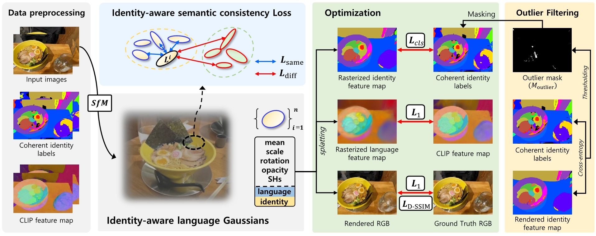

<h1 align="center">Identity-aware Language Gaussian Splatting for Open-vocabulary 3D Semantic Segmentation</h1>

Official Pytorch implementation "Identity-aware Language Gaussian Splatting for Open-vocabulary 3D Semantic Segmentation" <br>
[SungMin Jang](https://github.com/jsmbank), and [Wonjun Kim](https://sites.google.com/view/dcvl) (Corresponding Author) <br>
🌸***IEEE/CVF International Conference on Computer Vision, (ICCV)***, Oct. 2025.🌸


<p align="center">[ Training pipeline ]</p>

## :eyes: Overview

We propose **Identity-aware Language Gaussian Splatting (ILGS)**, a simple yet powerful method to resolve view-inconsistent language embeddings for open-vocabulary 3D semantic segmentation.

ILGS introduces two key components: an **identity-aware semantic consistency loss** to ensure consistent features across views, and a **progressive mask expanding** scheme for precise boundary segmentation.

We provide:

- ✅ **Full Implementation**: The complete source code for ILGS.
- 🪄 **3D Editing Demos**: Examples of object removal, color modification, and resizing.

## Installation

Please refer to [Installation.md](documents/Installation.md) for installation.

## Download

We provide guidelines to download datasets. </br>
Please check [Download.md](documents/Download.md) for more information.

## ✅ Full Implementation

Prepare Please refer to [Implementation.md](documents/Implementation.md) for open-vocabulary segmentation.


## 🪄 3D Editing Demos


## Acknowledgments
This work was supported by the National Research Foundation of Korea (NRF) funded by the Korea Government (MSIT) under Grant RS-2023-NR076462.

Our implementation and experiments are built on top of open-source GitHub repositories. We thank all the authors who made their code public, which tremendously accelerates our project progress. If you find these works helpful, please consider citing them as well.

[lkeab/gaussian-grouping]([[https://github.com/graphdeco-inria/gaussian-splatting](https://github.com/minghanqin/LangSplat)](https://github.com/lkeab/gaussian-grouping))  </br>
[minghanqin/LangSplat](https://github.com/VITA-Group/FSGS)  </br>

## Citation
If you find our work useful for your project, please consider citing the following paper.
```
@inproceedings{jsmbankILGS,
  title={Identity-aware Language Gaussian Splatting for Open-vocabulary 3D Semantic Segmentation},
  author={Jang, SungMin and Kim, Wonjun},
  booktitle={Proceedings of the International Conference on Computer Vision},
  year={2025}
}
```
